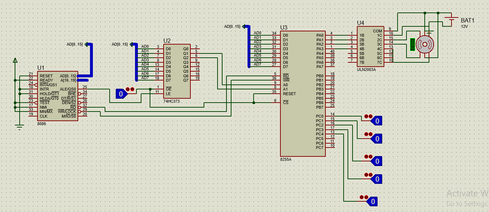
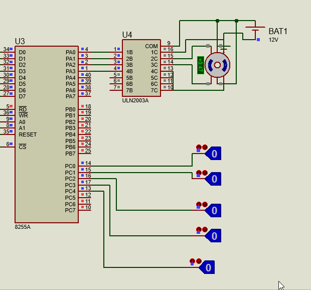
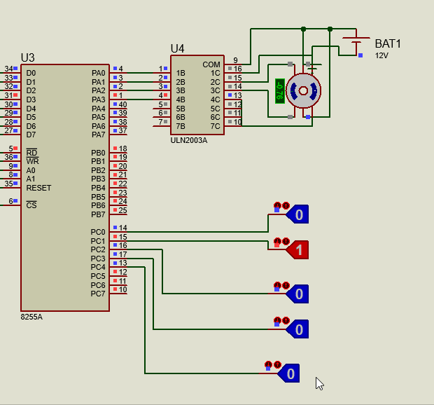
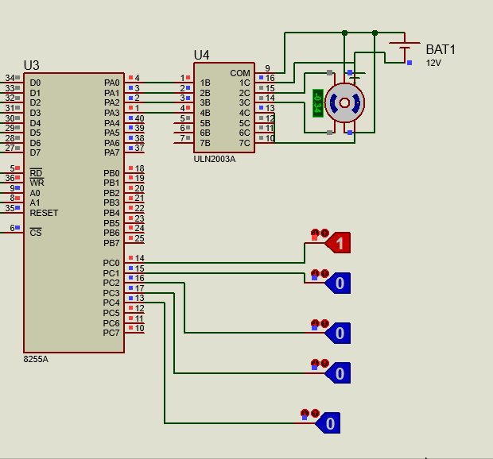
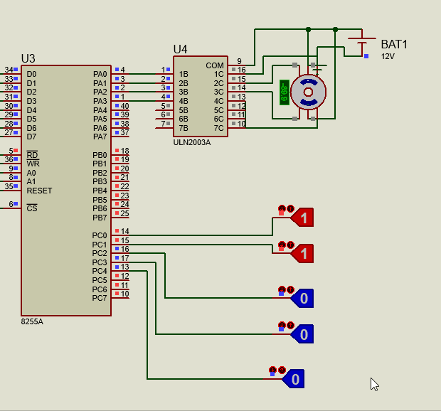

# Stepper_Motor :cd:
## Table Of Contents
 * [Stepper motor working princible](#desc)
 + [Components](#comp)
 - [Code Explanation](#code)
    1. Modes
       * [Half mode](#half) 
       * [Full mode](#full)  
    2. Directions      
       * Clock-Wise
       * Anti Cloc-Wise
    3. Speed      
       * Normal
       * Intermediate
       * Fast
       
<a name="desc"></a>
## Stepper motor working princible
> - this project explains how to control -5 leads unipolar- stepper motor using 8086 micro processor This project is programmed in assembly language, and designed using protous 8.6
> - we start with controlling the mode of the motor:
> ### stepper motor works in 3 different modes ,we will cover only two of them :
>       - full mode
>       - half mode
> ### stepper motor rotates in two direction:
>      - anti clockwise
>      - clockwise
> ### stepper motor works in different speeds: 
>      - normal speed
>      - intermediate speed 
>      - high speed
> ### to control the speed:
> - we used  3 buttons..
>    - the 1st btn makes the motor rotates with an normal speed
>    - the 2nd btn makes the motor rotates with an intermediate speed
>    - the 3rd btn makes the motor rotates with high speed
<a name="comp"></a>
## Components
> ### Circuit Design
> 
> 
> ### 1- 8086 µp
> > so after all 8086 µp is only the CPU of our program -processes and  executes our assembly code- so it needs to be connected to a 
> > storage device and an I/O device, here comes the rule of …
> ### 2- latch : 74HC373 
> >  is an octal D-type transparent latch , works as storage device, holds data through feedback lane
> >
> ### 3- I/O device : 8255A  
> >  intel general purpose programmable  I/O device, used in 2 modes either i/o mode or BSR mode, in out project it’s used  in i/O mode.
 > >  - It has 3-ports are used as i/o ,(PortA,PortB,PortC).
  > > - PORTC is consist of PC Lower, PC Upper.
  > > -  There are different modes ,we use mode 0.
  > > -  So,let D6=0 , D5=0 ,D2=0.
 >  > -  To use as i/o mode ,let D7=1.
> > 
> > - Control register (CR)= D7 D6 D5 D4 D3 D2 D1D0
> > - In our code use :
> >      - portA o/p
> >      - PORTB
> >      - PORTC I/P
> > - So,CR=10000001

> ### 4- motor driver:  ULN2003A   
> > is a type of motor driver used to amplify the current produced by our circuit to suit the current needed by the stepper 
> >
> ### 5- stepper motor
> ### 6- battary 12V
> ### 7- logicstates

 
 <a name="code"></a>
## Code Explanation
>   we have in our code 11 Procedures.
>  - MODE PROC
> > Determine whice mode is choosed by user by:
> > Get input from portc by logic gates (0 or 1 )
> >  - PC0 =1   go to full mode.
> >  - PC0 =0   go to half mode.
> > Call in the start of code.
>   - PRESS PROC
> > Check if user change mode,or direction ,or speed by:
> >  Compare the Present value of portc by the provious value of portc.
> >   Call after ever steps in half or full mode.
>  - FULLCW
>  - FULLACW
>  - HALFCW
>  - HALFACW
> >    - This 4 procedures have code of every mode (steps that motor do).
> >    - Port A is get its value for every revolution from this procedure.
> >    - Is Determined after call MODE PROC by check PC1. 
> >        - PC1 =0         go to clock wise 
> >        - PC1 =1         go to anti clock wise 

>  - DELAY PROC
> > In our project ,we control speed by using different delays after every revolution.
> >    - We have 3 speeds low , intermediate , high.
> >    - Every speed has its own delay.
> >    - Delay low >> delay intermediate >> delay high
> >    - Is determined by check PC2 , PC3  , PC4
> >        - PC2  =1    speed is low.
> >        - PC3  =1    speed is intermediate.
> >        - PC3  =1    speed is high.
> >        - Motor will stop , when PC2  =0   &&  PC3  =0   &&  PC4  =0   
> >            

>  - NORMP PROC
>  - MIDP PROC
>  - FASTP PROC
> > This 3 procedure have code whice control delay for every speed.
>  - STOPP PROC
> > This proc let portA take 00H as o/p to let motor stop working.
 
  <a name="half"></a>
### Half Mode
  
> - The motor rotates a full revolution in 8 steps ,each step is a 45o  step angle  . 
> - This mode works on the alternate energizing principle ,at one moment only 1 coil is energized, but in the very next moment 2 coils are energized, then again back to 1.       
> ### This table shows the logic of programming stepper motor in full mode in clock wise.
> - To rotate the motor in anti-clock wise just reverse the logic from bottom to top.

> 

  
~~~markdown
 # Half Clock-Wise
 # intermediate speed
 
~~~
> 

```javascript
HALFCWP PROC
MOV AL, 00001000B  ;moves 08H to AL
  OUT PORTA,AL       
;--------------------
  CALL PRESS
 CALL DELAY ;DELAY
;--------------------
  MOV AL, 00001100B
  OUT PORTA,AL       
;--------------------
  CALL PRESS
 CALL DELAY ;DELAY
;--------------------
   MOV AL, 00000100B
  OUT PORTA,AL
;--------------------
  CALL PRESS
CALL DELAY ;DELAY
;--------------------
  MOV AL, 00000110B
  OUT PORTA,AL
;--------------------
  CALL PRESS
CALL DELAY ;DELAY   
;--------------------
 MOV AL, 00000010B
  OUT PORTA,AL
;--------------------
  CALL PRESS
CALL DELAY ;DELAY  
;--------------------
  MOV AL, 00000011B
  OUT PORTA,AL
;--------------------
  CALL PRESS
CALL DELAY ;DELAY 
;--------------------
  MOV AL, 00000001B
  OUT PORTA,AL
;--------------------
  CALL PRESS
CALL DELAY ;DELAY  
;--------------------
  MOV AL, 00001001B
  OUT PORTA,AL
;--------------------
  CALL PRESS
CALL DELAY ;DELAY  
;--------------------
RET
  HALFCWP ENDP
   ```
  
  
~~~markdown
# Half Anti Clock-Wise
# fast speed
 
~~~
> 

```javascript
HALFACWP PROC
MOV AL, 00001001B      
  OUT PORTA,AL
;--------------------
  CALL PRESS
 CALL DELAY ;DELAY    
;--------------------
  MOV AL, 00000001B
  OUT PORTA,AL
;--------------------
  CALL PRESS
 CALL DELAY ;DELAY    
;--------------------
  MOV AL, 00000011B
  OUT PORTA,AL
;--------------------
  CALL PRESS
CALL DELAY ;DELAY 
;--------------------
  MOV AL, 00000010B
  OUT PORTA,AL
;--------------------
  CALL PRESS
  CALL DELAY ;DELAY   
;--------------------
  MOV AL, 00000110B
  OUT PORTA,AL
;--------------------
  CALL PRESS
CALL DELAY ;DELAY    
;--------------------
   MOV AL, 00000100B
  OUT PORTA,AL
;--------------------
  CALL PRESS
CALL DELAY ;DELAY   
;--------------------
  MOV AL, 00001100B
  OUT PORTA,AL
;--------------------
  CALL PRESS
 CALL DELAY ;DELAY  
;--------------------
 MOV AL, 00001000B
  OUT PORTA,AL
;--------------------
  CALL PRESS
CALL DELAY ;DELAY    
;--------------------
RET
  HALFACWP ENDP
   ```


 
  <a name="full"></a>
### FULL Mode
>  - The motor rotates a full revolution in 4 steps ,each step is a 90o  step angle , In this mode two coils are energized - logic 1 is given to two coils - at a time 
> ### This table shows the logic of programming stepper motor in full mode in clock wise direction where A,B,C and D are the coils of the motor.
>  - To rotate the motor in anti-clock wise just reverse the logic from bottom to top

> 

  
~~~markdown
# FULL Clock-Wise
# fast speed

~~~
> 

```javascript
FULLCWP PROC
MOV AL, 00000110B
  OUT PORTA,AL
;--------------------
  CALL PRESS
CALL DELAY ;DELAY 
;--------------------
  MOV AL, 00001100B
  OUT PORTA,AL
;--------------------
  CALL PRESS
CALL DELAY ;DELAY 
;--------------------    
  MOV AL, 00001001B
  OUT PORTA,AL
;--------------------
  CALL PRESS
 CALL DELAY ;DELAY 
;--------------------    
  MOV AL, 00000011B
  OUT PORTA,AL
;--------------------
CALL PRESS
CALL DELAY ;DELAY 
;-----------------

RET
  FULLCWP ENDP
   ```
   

  
~~~markdown
# FULL Anti Clock-Wise
# slow speed

~~~
> 

```javascript
FULLACWP PROC
MOV AL, 000000011B
  OUT PORTA,AL
;--------------------
CALL PRESS
CALL DELAY ;DELAY 
;--------------------
  MOV AL, 00001001B
  OUT PORTA,AL
;--------------------
CALL PRESS
CALL DELAY ;DELAY 
;--------------------    
  MOV AL, 00001100B
  OUT PORTA,AL
;--------------------
CALL PRESS
 CALL DELAY ;DELAY 
;--------------------    
  MOV AL, 00000110B
  OUT PORTA,AL
;--------------------
CALL PRESS
CALL DELAY ;DELAY 
;-----------------
RET
  FULLACWP ENDP
   ```
 
 
